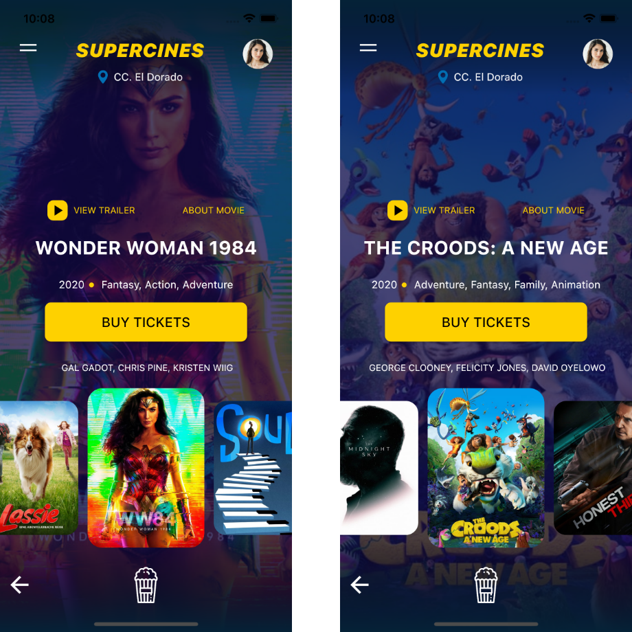
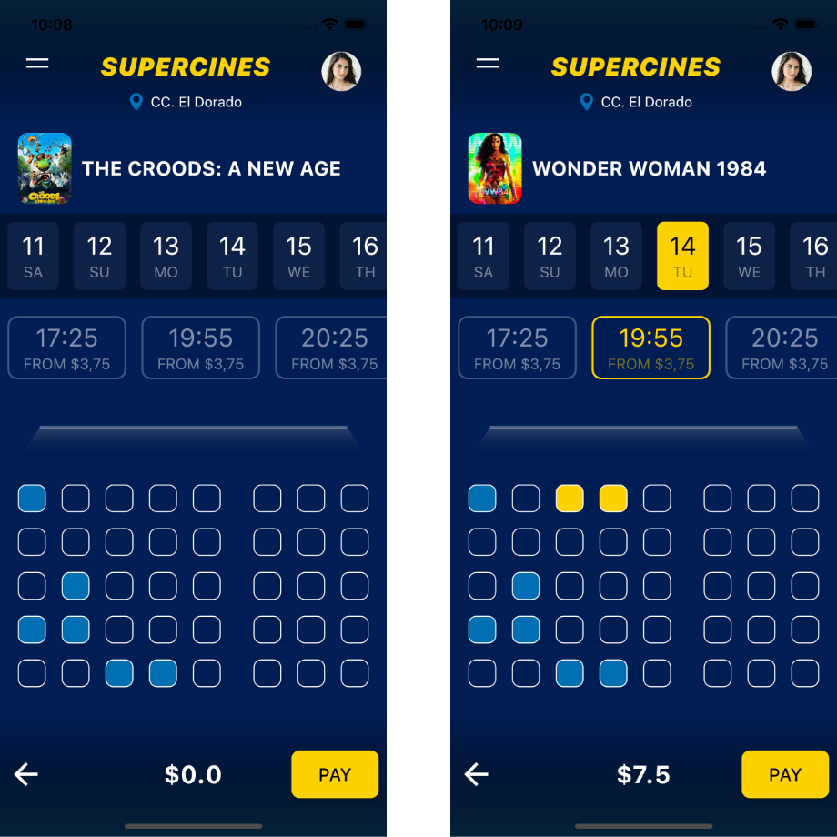

# Supercines
  


## Introduction 

A new Flutter project implementing a buy tickets concept from Dribbble, design credits to Aldo Mora. This UI is for Android an iOS. I developed this application just for learning purpose, You can see current movies, buy tickets, select seats and view a lot of animations.

## Screens


<pre>

</pre>



## Author

## 🤝 Contributing

Contributions, issues and feature requests are welcome! <br/>Feel free to check [issues page](https://www.coolflutter.com/).

## 🤔 Questions?
You can find me on [](https://twitter.com/burhanrashid52) [](https://www.instagram.com/deus_magna/) [](https://www.linkedin.com/in/deus-magna/)

## Show your support

Give a ⭐️ if this project helped you!

## Credits
- UI/UX Design to [**Aldo Mora**](https://dribbble.com/sprezet?fbclid=IwAR0xj-zhQCkaSHBLBksLEO0VNgV_DBcBjPaWpNJ-FIKLkoxm1MBdC_2b7-8)
- Flutter [**Documentation**](https://flutter.io/docs/)

## Getting Started

This project is a Flutter Application, you can use Visual Studio Code or Android Studio to build it.

```sh
flutter packages get
flutter run --release
```
